# Device Discovery Service

## Overview

`device-discovery` is a Go gRPC service implementing the CT-Disc (CamThink Device Discovery & Management) protocol for automatic discovery and management of CamThink devices on the network.

## Directory Structure

```
platform/device-discovery/
├── server/main.go       # Service entry point
├── discovery/
│   ├── ctdisc.go        # CT-Disc protocol definitions
│   ├── listener.go      # UDP multicast listener
│   ├── announcer.go     # UDP multicast announcer (device-side broadcast)
│   ├── registry.go      # Device registry
│   └── errors.go        # Error definitions
├── handler/handler.go   # gRPC handler
└── proto/
    ├── discovery.proto
    ├── discovery.pb.go
    └── discovery_grpc.pb.go
```

## System Architecture Diagram

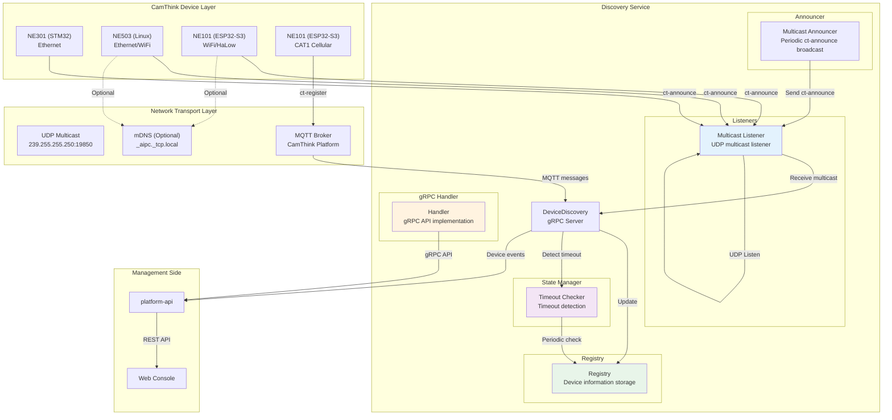

## CT-Disc Protocol Interaction Flow

### Scenario 1: Device Power-On Auto Discovery (Multicast Mode)

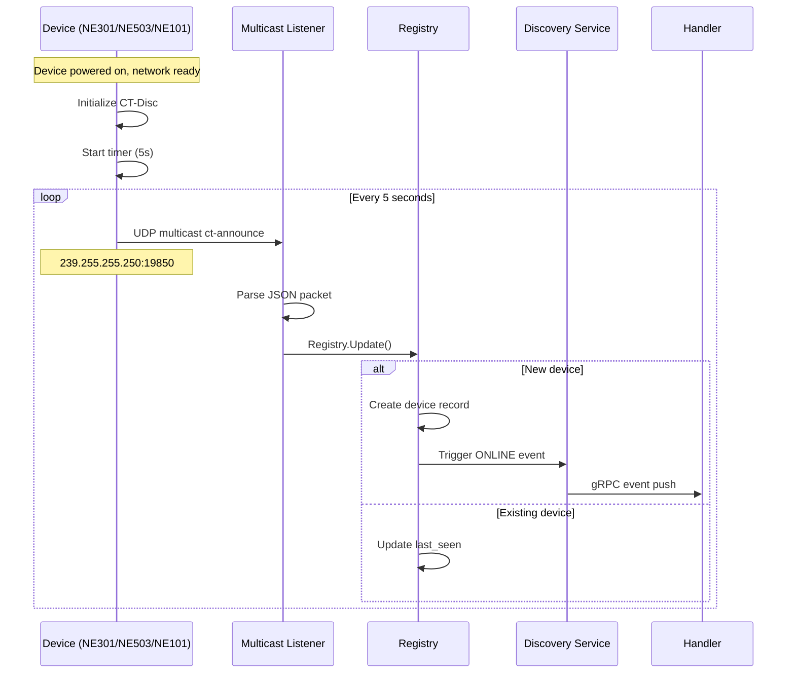

### Scenario 2: Device State Management

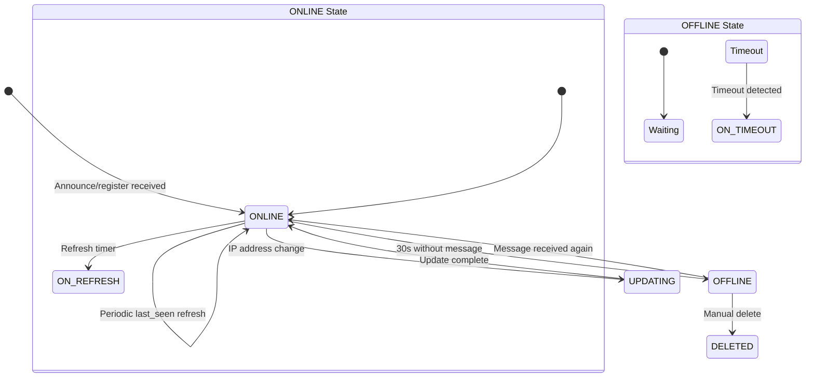

### Scenario 3: Multi-Protocol Device Unified Management

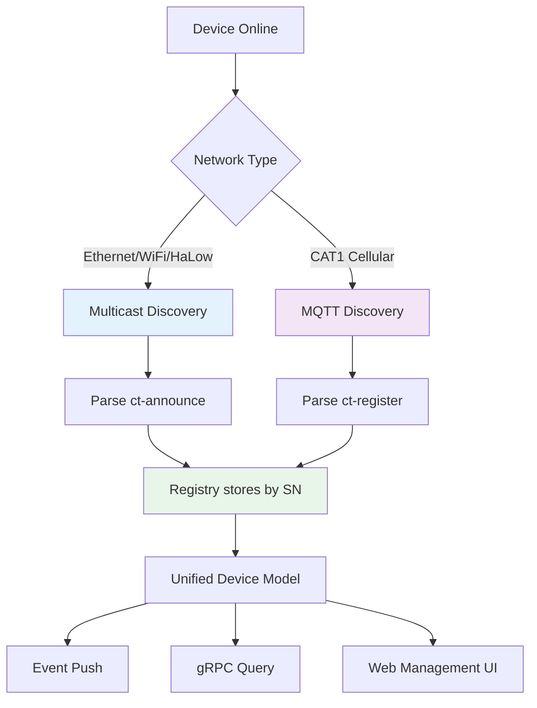

## gRPC API

Service name: `aipc.discovery.DiscoveryService`, listening on `unix:///run/aipc/device-discovery.sock`.

### ListDevices Flow

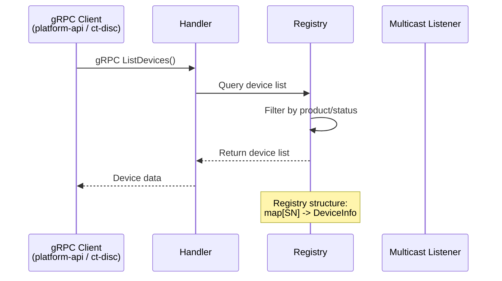

> Note: the `DiscoveryHandler` gRPC client exists in platform-api, but no
> `/api/v1/discovery/*` HTTP routes are currently registered — discovery is
> consumed directly via gRPC (or by the `ct-disc` CLI tool).

### Manual Scan Flow

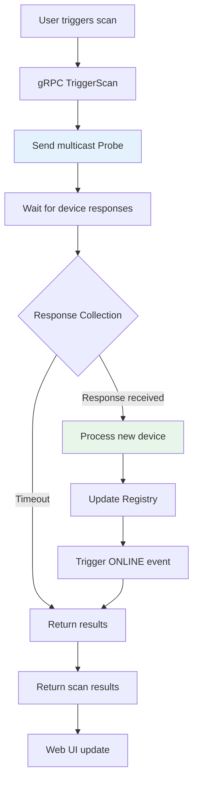

## CT-Disc Protocol Specification

> The canonical wire-level protocol spec (message types, MQTT commands,
> state machine, capability identifiers, product defaults) is maintained in
> [`../references/CT_DISC_PROTOCOL.md`](../references/CT_DISC_PROTOCOL.md).
> This section is an abridged summary tied to the `device-discovery`
> implementation.

### Multicast Transport Parameters

| Parameter | Value |
|-----------|-------|
| Transport | UDP Multicast |
| Multicast Address | `239.255.255.250` |
| Target Port | `19850` |
| Broadcast Interval | `5000ms` |
| Max Packet Size | `512 bytes` |

### MQTT Transport Parameters

> The `device-discovery` service itself speaks UDP multicast only. The MQTT
> transport below is used by the **`ct-disc` CLI tool** to send commands to
> devices (and by the NE101 CAT1 device side); the service does not subscribe
> to the broker.

| Parameter | Value |
|-----------|-------|
| Register Topic | `ct/disc/register` |
| Command Topic | `ct/cmd/{sn}` |
| Response Topic | `ct/resp/{sn}` |
| Register QoS | `0` |
| Command QoS | `1` |
| Register Interval | `30000ms` |

### JSON Payload Format

**Multicast Announce**:
```json
{
    "type": "ct-announce",
    "product": "NE101",
    "sn": "CT101-2026-00001",
    "mac": "AA:BB:CC:DD:EE:FF",
    "ip": "192.168.1.50",
    "fw": "v1.0.0",
    "port": 80,
    "hw": "ESP32-S3",
    "caps": ["camera", "mqtt", "http"]
}
```

**MQTT Register**:
```json
{
    "type": "ct-register",
    "product": "NE101",
    "sn": "CT101-2026-00001",
    "mac": "AA:BB:CC:DD:EE:FF",
    "ip": "10.0.1.50",
    "fw": "v1.0.0",
    "port": 80,
    "hw": "ESP32-S3",
    "caps": ["camera", "mqtt", "http", "cellular"],
    "net": "cat1"
}
```

### Device State Management

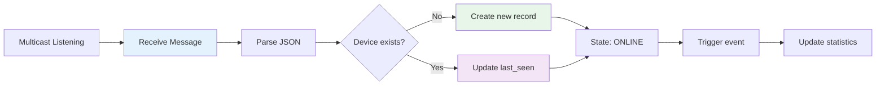

## gRPC API Interfaces

### ListDevices

```protobuf
rpc ListDevices(ListDevicesRequest) returns (ListDevicesResponse)
```

| Field | Type | Description |
|-------|------|-------------|
| **Request** | | |
| `product` | string | Filter by product model, empty string for no filter |
| `status` | DeviceStatus | Filter by device status |
| **Response** | | |
| `devices` | DiscoveredDevice[] | Device list |

### GetDevice

```protobuf
rpc GetDevice(GetDeviceRequest) returns (DiscoveredDevice)
```

| Field | Type | Description |
|-------|------|-------------|
| **Request** | | |
| `serial_number` | string | Device serial number |

### TriggerScan

```protobuf
rpc TriggerScan(TriggerScanRequest) returns (TriggerScanResponse)
```

| Field | Type | Description |
|-------|------|-------------|
| **Request** | | |
| `timeout_seconds` | int32 | Scan timeout |
| **Response** | | |
| `found_count` | int32 | Number of devices found |
| `new_devices` | DiscoveredDevice[] | New device list |

### WatchDevices

```protobuf
rpc WatchDevices(WatchDevicesRequest) returns (stream DeviceEvent)
```

| Field | Type | Description |
|-------|------|-------------|
| **Event** | | |
| `type` | EventType | `ONLINE` / `OFFLINE` / `UPDATED` |
| `device` | DiscoveredDevice | Device information |

> There is **no** `SendCommand` gRPC RPC in the `DiscoveryService` service
> (the proto defines only `ListDevices`, `GetDevice`, `TriggerScan`, and
> `WatchDevices`). Device commands are sent out-of-band by the `ct-disc` CLI
> tool over MQTT — see [MQTT Command Format](#mqtt-command-format).

## Network Topology Diagram

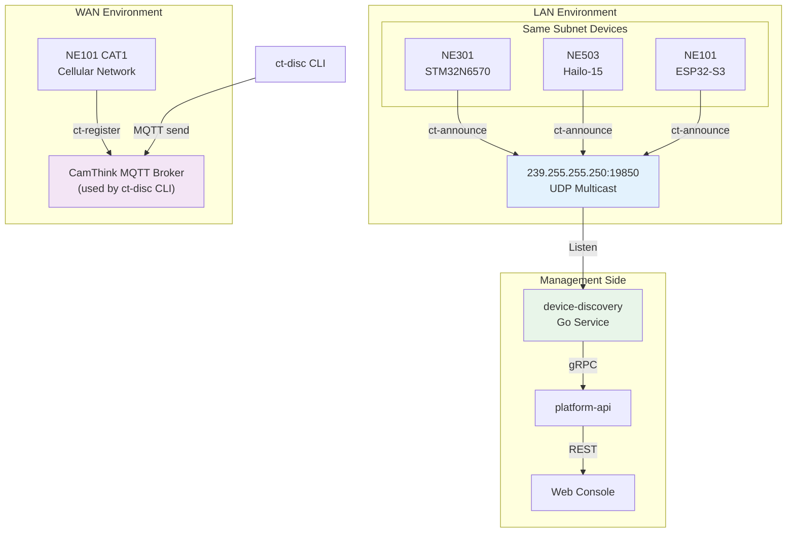

## Device-Side MQTT Architecture (NE101 CAT1)

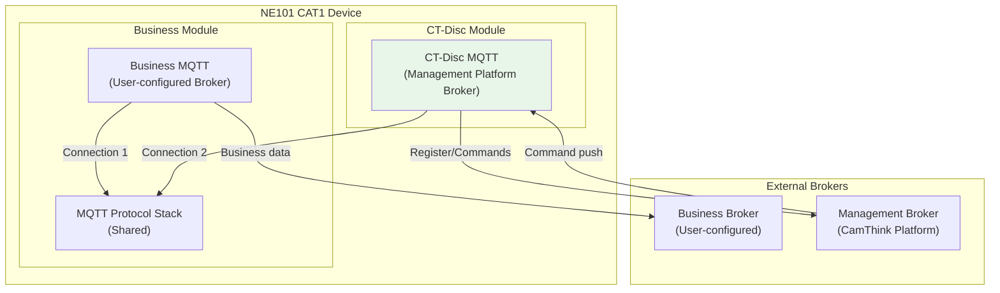

## Configuration

Configuration file: `configs/platform/discovery.yaml`

```yaml
service:
  name: device-discovery
  listen: unix:///run/aipc/device-discovery.sock
  log_level: info

discovery:
  multicast_addr: 239.255.255.250
  multicast_port: 19850
  timeout: 30
  interface: ""

announce:
  enabled: true
  product: "NE503"
  port: 8080
  interval: 5
  caps:
    - ai
    - camera
    - http
    - mqtt
```

### MQTT Command Format

**Command Topic: `ct/cmd/{sn}`**
```json
{
    "id": "cmd-20260520-001",
    "action": "reboot",
    "params": {},
    "timestamp": 1716163200
}
```

**Command Response Topic: `ct/resp/{sn}`**
```json
{
    "id": "cmd-20260520-001",
    "result": "ok",
    "data": {},
    "timestamp": 1716163201
}
```

### Standard Management Commands

| action | Description | params | Typical Devices |
|--------|-------------|--------|-----------------|
| `reboot` | Reboot device | `{}` | All |
| `get_info` | Get device details | `{}` | All |
| `set_config` | Push configuration | `{key: value}` | All |
| `ota_upgrade` | OTA upgrade | `{"url": "..."}` | NE101, NE503 |
| `capture` | Trigger photo capture | `{}` | NE101 |
| `set_network` | Modify network config | `{"mode": "static"}` | NE503 |

## Monitoring and Statistics

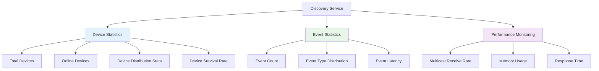

## Build

```bash
make platform  # Build all platform services (including device-discovery)
```

### Startup Flow

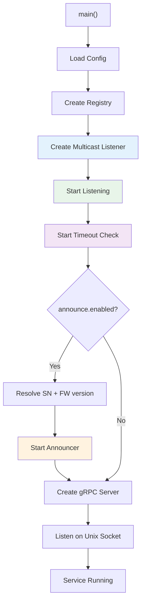

## Desktop Management Tools

Prebuilt binaries (Windows GUI zip, cross-platform CLI, SHA-256 checksums) are published on GitHub Releases: `https://github.com/camthink-ai/neoruntime/releases`. Tool-only releases are tagged `ct-disc-v<version>`; full OS release tags (`v<version>`) carry the tools as well.

### ct-disc CLI

A command-line tool for device discovery and management from a desktop/laptop:

```bash
# Build
cd tools/ct-disc && go build -o ct-disc .

# Commands
ct-disc list                          # List discovered devices
ct-disc list --watch                  # Continuous watch mode
ct-disc scan                          # Active scan for devices
ct-disc scan --iface eth0             # Scan on specific interface
ct-disc send --sn CT503-001 reboot    # Send command via MQTT
```

Source: `tools/ct-disc/`

### ct-disc-gui (Wails Desktop App)

A cross-platform desktop GUI built with Wails v2 (Go backend + React frontend):

```
tools/ct-disc/gui/ct-disc-gui/
├── app.go                    # Wails bindings (discovery, network config)
├── main.go                   # Window configuration
├── frontend/
│   └── src/
│       ├── App.tsx           # Main layout
│       ├── components/
│       │   ├── DeviceTable.tsx         # Device list
│       │   ├── DeviceDetail.tsx        # Device detail panel
│       │   ├── CommandDialog.tsx       # MQTT command dialog
│       │   ├── NetworkConfigDialog.tsx # Device network configuration
│       │   ├── StatusBar.tsx           # Listener stats + device counts
│       │   └── SettingsPanel.tsx       # MQTT broker settings
│       └── hooks/
│           └── useDevices.ts           # Wails event binding hook
└── wails.json
```

**Features:**
- Real-time device list with online/offline indicators
- Network interface selection
- Active scan button
- Device detail panel (SN, product, IP, firmware, capabilities)
- Open device management page in browser
- Send MQTT commands to devices
- Network configuration (DHCP/static IP, gateway, DNS)
- Listener statistics (packet receive count, event count)

**Build:**
```bash
cd tools/ct-disc/gui/ct-disc-gui
wails build -clean -ldflags "-s -w"
# Output: build/bin/ct-disc-gui (Linux/macOS) or build/bin/ct-disc-gui.exe (Windows)
```

**Development:**
```bash
cd tools/ct-disc/gui/ct-disc-gui
wails dev
```
